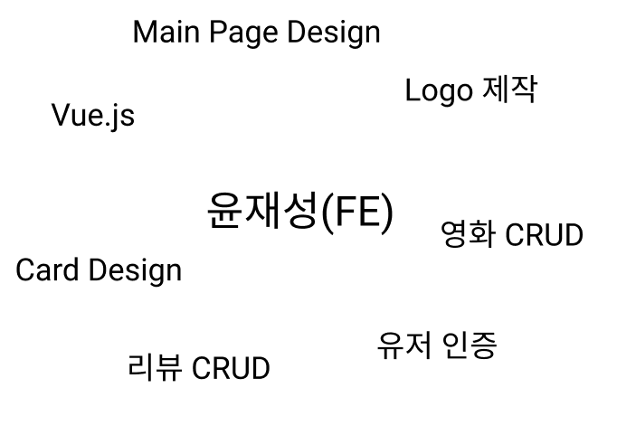
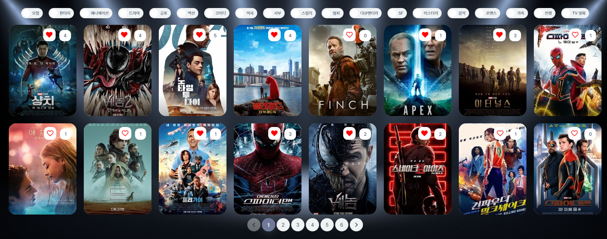

# MCloud 

> By team. Ready-ofCourse (박승원, 윤재성)

MCloud는 `Movie`의 M과 `WordCloud`의 Cloud를 합성하여 만든 저희 사이트의 이름으로 사용자에게 영화정보와 영화의 리뷰를 공유하는 커뮤니티 사이트입니다. `Vue.js` 와 `Django` 를 기반으로 제작하였습니다.

### I. Who are we?

> FE : 구미 1반 윤재성
>
> BE : 구미 1반 박승원 

> 윤재성

- FE (Vue.js)
  - 전체 구성요소의 CRUD 동작을 구현하고, 디자인을 맡았습니다.
  - 사용자가 직접 이용할 때를 고려하여 동작에 어색함을 없애고자 노력하였습니다.
  - 사용자에게 전달되는 정보가 효과적으로 전달될 수 있도록 배치와 디자인을 고려하였습니다.

> 박승원

- BE (Django)
  - 화면의 구성에 필요한 정보를 때와 요청에 맞게 `serializer` 로 응답하여 서버가 동작하도록 구현하였습니다.
  - 사용자에게 맞는 영화를 추천하기 위해 알고리즘을 구현하였습니다.
  - 효과적인 정보 전달과 추천 방식을 위한 워드 클라우드를 구현하였습니다.
  - 워드 클라우드 구현 과정에서 TMDB, 네이버, AIOPEN API 등 다양한 API와 라이브러리를 이용하여 데이터 크롤링과 데이터 분석을 통해 해당 영화의 키워드를 추출하였습니다.
  - `vue-awesome-swiper` 를 이용하여 효과적인 정보전달과 흥미를 고려하였습니다. 

### II. 목표 서비스 구현 및 실제 구현 정도

#### II - 1. 초기 목표

- 프로젝트 명세의 요구사항외에 구현하고자 했던 목표
  - 기능
    - 워드클라우드를 이용한 영화 상세 정보 전달
    - 사용자 좋아요를 이용한 영화 추천 알고리즘
    - 일간, 주간 박스오피스 순위
    - 영화관 위치 알림 서비스
    - 나만의 영화포스터 (영화 포스터와 사용자의 사진 합성)
  - 디자인
    - 영화 정보를 축약하고 있는 Card 디자인
    - CSS 애니메이션을 이용한 디자인
    - Carousel 이용한 목록 조회
    - 영화 장르별 필터 구현

#### II - 2. 실제 구현

- 목표 달성 정도 (70%)
  - 기능
    - 프로젝트 명세 요구사항 만족
    - 워드클라우드 이용한 영화 상세 정보 전달
    - 사용자 좋아요를 이용한 영화 추천 알고리즘
    - 워드 클라우드를 활용한 `RandomBox` 를 통해 사용자에게 영화추천
    - 좋아요, 시청, 리뷰를 바탕으로 프로필에서 사용자 정보 전달
  - 디자인
    - CSS 애니메이션을 이용한 디자인
    - Swiper를 이용한 디자인 (입체감 3D 효과)
    - 사용자 친화적인 동작과 배치
    - 다양한 CSS 디자인 요소와 라이브러리를 이용한 효과적인 정보전달

> 실제 초기의 목표에서 구현하고자 했던 기능을 모두 구현한 것은 아니지만 구현된 기능에서 디자인과 더 좋은 아이디어를 바탕으로 결과물의 완성도는 더욱 높아졌다고 생각합니다. 

### III. 데이터베이스 모델링 (ERD)

### IV. 필수 기능에 대한 설명

> 회원가입/로그인/로그아웃

- 사이트에 접속하면 로그인 되어있지 않은 사용자에 대해 로그인, 회원가입 페이지로 이동하여 로그인을 하도록 하였습니다.
- 로그인을 하지않아도 영화 조회나, 리뷰 조회 등의 기능을 이용할 수 있지만 다양한 기능을 사용하려면 로그인을 해야 이용할 수 있도록 구현하였습니다.

> 메인 페이지

- 네비게이션 바를 구현하여 사용자가 사이트를 이동할 수도 있지만, 메인 화면에서 사이트 로고와 함께 메뉴를 구현하여 사용자가 필요한 곳으로 이동할 수 있도록 구현하였습니다.

> 영화 조회

- 영화 전체를 조회할때 축약된 정보를 담고 있는 영화 카드를 이용하여 표현하였습니다.
- 그 과정에서 페이지네이션을 이용해 페이지 별로 나누어 영화 정보를 전달하였습니다.
- 추가적으로 장르에 대한 필터를 구현하여 중복된 장르에 대해서도 장르별 영화를 조회하도록 구현하였습니다.

- 영화 상세 조회에서는 해당 영화의 정보를 전달할 뿐 아니라 해당 영화의 네이버 리뷰를 바탕으로 분석된 워드 클라우드를 구현하여 사용자가 한눈에 영화의 정보를 얻을 수 있도록 구현하였습니다.
- 추가적으로 해당 영화의 리뷰를 댓글처럼 구현하여 해당 영화에 대한 커뮤니티 리뷰의 상세조회로 이동할 수 있도록 구현하였습니다.

> 리뷰 조회, 생성, 수정, 삭제

- 전체 리뷰 조회에서 최신에 작성된 글이 위로 올 수 있도록 구성하였습니다.
- 해당 게시판에서 id 를 누르면 유저의 프로필로, 영화를 누르면 해당 영화의 상세 조회 페이지로, 제목을 누르면 리뷰 상세 조회 페이지로 이동하도록 구현하였습니다.

- 리뷰 작성 시 어떤 영화에 대한 리뷰를 작성하는 지 현재 영화 목록을 이용하여 사용자에게 정확학 영화 제목을 받을 수 있도록 구현하였습니다.
- 제목, 내용 등 정보가 충분하지 않으면 경고 메시지를 출력하였습니다.

- 리뷰 상세 조회에서는 상세 조회와 함께 해당 유저가 남긴 평점 등의 정보를 전달하였습니다.
- 추가적으로 좋아요와 댓글 기능을 구현하여 사용자들 간의 커뮤니케이션이 될 수 있도록 하였습니다.

- 리뷰 수정 또한 구현하였습니다.

> 영화 추천 알고리즘

- 사용자가 좋아요 누른 영화를 바탕으로 가장 좋아하는 2개의 장르를 찾아 해당 영화들의 TMDB 기준 인기도가 높은 영화 상위 5개씩을 추출하고 현재 좋아요 누른 영화와 해당 영화들의 중복을 제거하여 사용자에게 추천하도록 구현하였습니다.

- 표현할 때 입체감 있는 swiper를 활용하여 화면에 표현하였으며, 해당영화를 클릭시 영화의 상세페이지로 이동하도록 구현하였습니다.

> 랜덤 박스

- MCloud의 자랑, 영화들의 워드클라우드로 사용자가 관심있는 영화를 골라 추천하도록 하였습니다.
- 각 워드클라우드를 3D Cube에 표현하여 사용자가 재미있게 옆으로 돌려가면서 영화를 고를 수 있도록 하였습니다.
- 단순히 랜덤한 영화를 추천하는 것이 아닌 워드클라우드를 보고 '어? 어떤 영화지?' 하는 궁금증과 흥미를 유발하는 아이디어라고 생각합니다.

> 프로필

- 프로필에서는 사용자가 좋아요한 영화 목록과 리뷰작성을 기반으로 한 시청한 영화 목록을 보여줍니다.
- 같은 영화에 여러개의 리뷰를 작성해도 중복을 제거하여 하나만 표시되도록 표현하였습니다.

- 사용자가 작성한 리뷰의 목록도 표시해주었습니다.

### V. 배포 서버 URL

- https://mcloudroc.netlify.app/ - FE

- https://readyofcourse.herokuapp.com/ - BE

### VI. 느낀점

